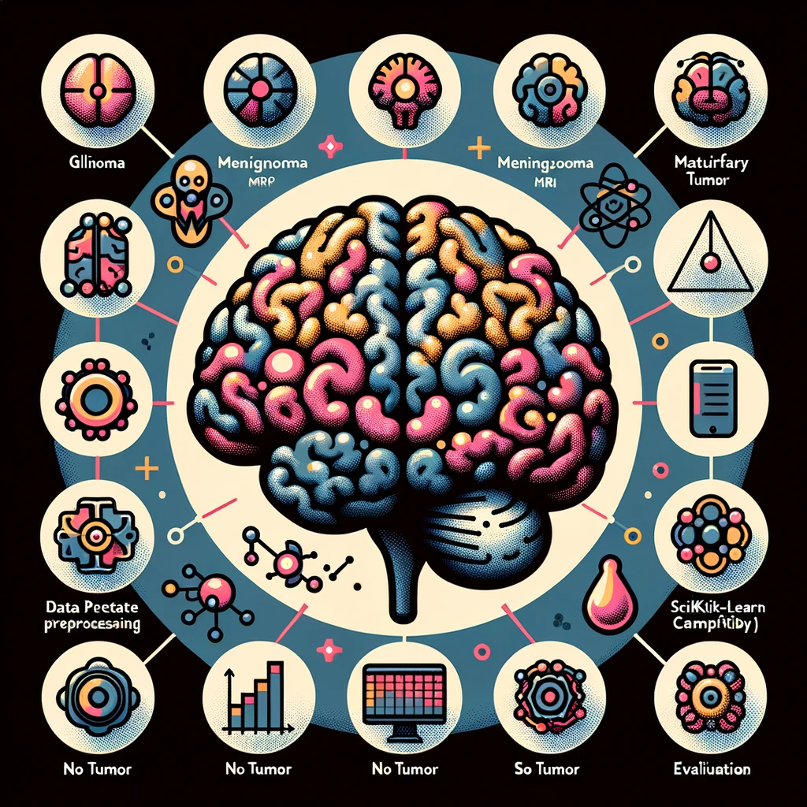

# Brain Tumor Classification Project

## Overview
This project focuses on the classification of brain MRI images into four categories of tumors: glioma, meningioma, no tumor, and pituitary tumor. It is designed as a single Jupyter notebook that encapsulates the entire process from image preprocessing to model evaluation, making use of both classical machine learning and deep learning techniques.

## Dataset
The dataset consists of MRI images of the brain categorized into four distinct classes. The notebook assumes the dataset is split into 'Training' and 'Testing' directories with each directory containing subdirectories for each category.

## Methodology
The project is divided into distinct steps, all contained within the notebook:

1. **Visualization of Samples**: The notebook starts by displaying sample images from each category to provide a visual understanding of the data.

2. **Preprocessing**: Images are preprocessed to convert them to grayscale, resize, normalize, and apply Gaussian blurring to make the model training more effective.

3. **Feature Engineering**: The preprocessed images are then flattened to create feature vectors suitable for classical machine learning model training.

4. **Model Training and Evaluation - k-NN Classifier**: The k-Nearest Neighbors (k-NN) algorithm is used to create a baseline model. The classification report is visualized to evaluate the performance.

5. **Convolutional Neural Network (CNN) Architecture**: A CNN model is constructed using TensorFlow and Keras, specifically designed to handle image data. The model includes layers such as Conv2D, MaxPooling2D, Flatten, Dense, and Dropout.

6. **Model Training - CNN**: The CNN model is compiled and trained using the preprocessed images. Training history for accuracy and loss is plotted to show the model's learning over epochs.

7. **Model Evaluation - CNN**: The CNN model is evaluated on the test set, and a confusion matrix and classification report are generated to assess its performance.

8. **Visualization**: Visualizations for the confusion matrix and classification report are created to provide clear and intuitive representations of the model's performance.

## Tools and Libraries
- Python
- Matplotlib for visualization
- OpenCV for image preprocessing
- NumPy for numerical operations
- TensorFlow and Keras for deep learning models
- Scikit-learn for machine learning models and metrics
- Seaborn for heatmap visualizations
- Yellowbrick for model visualization

## How to Use
To run the project, simply follow these steps:

1. **Clone the Repository**: Clone this repository to your local machine or download the Jupyter notebook file.

2. **Install Requirements**: Ensure that you have all the required libraries installed in your Python environment.

3. **Prepare Your Dataset**: Organize your dataset into the required format, with separate 'Training' and 'Testing' directories each containing subdirectories for all categories.

4. **Run the Notebook**: Execute the notebook cells in order to perform each step of the project from data preprocessing to model evaluation.

5. **Interpret Results**: Review the visualizations and metrics provided by the notebook to understand the performance of the models on the brain tumor classification task.

## Conclusion
The notebook aims to provide a comprehensive walkthrough for classifying brain tumors using machine learning and deep learning techniques. By adjusting parameters, experimenting with model architectures, and potentially augmenting the dataset, you can further improve the model's performance and gain deeper insights into the nature of brain tumors through MRI image analysis.
